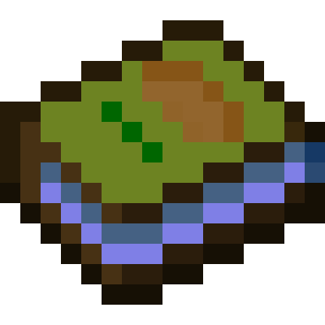
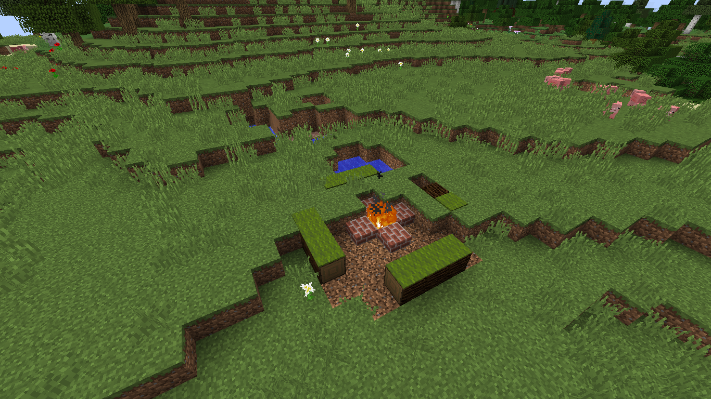
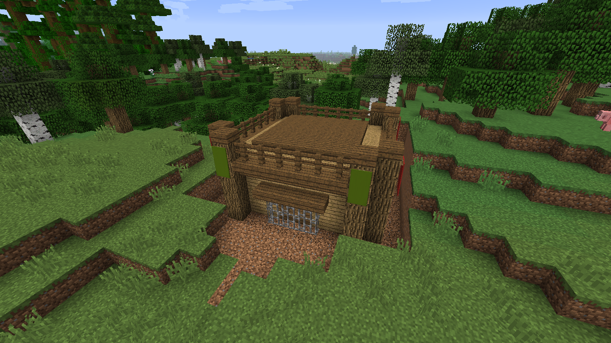
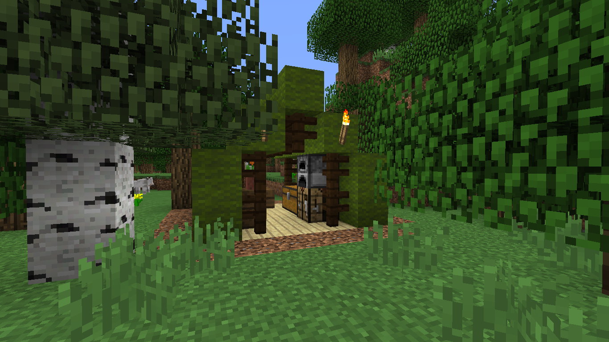
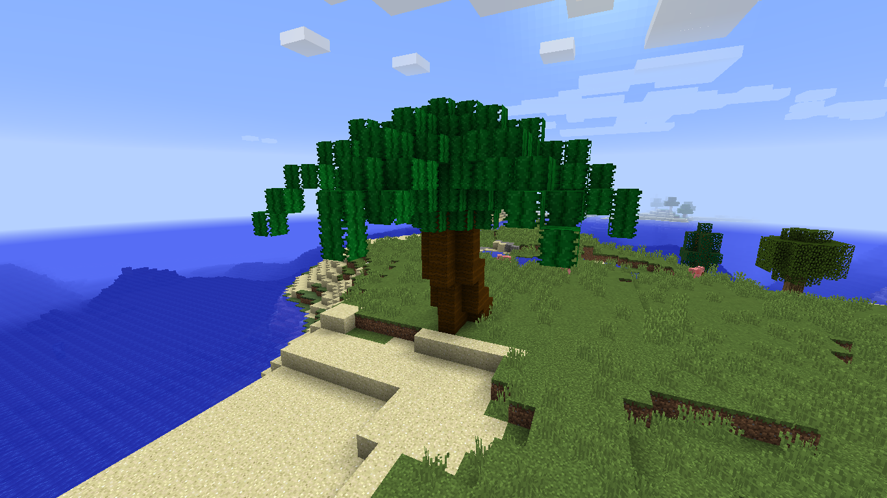
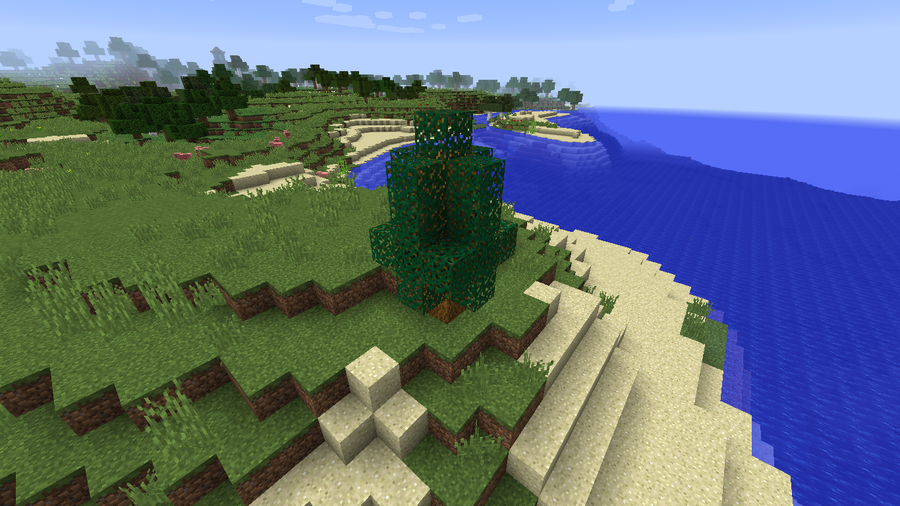
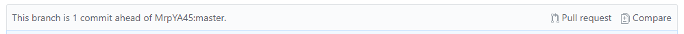

<b> TheBoyScout Mod</b>
--------
This is my first mod for Minecraft that adds lots of useful blocks and items and structures. It also adds some new weapons, advancements and mobs.

## Crafting
You can check the recipes through [JEI](https://minecraft.curseforge.com/projects/jei) or through the in-game recipe book.

## World generation
### Structures

<i>A campfire. Appears on forests and plains.</i>

  

<i>A fort. Appears on forests.
</i>
  

<i>A tent. Appears on forests and plains.
</i>
  

<i>A campfire. Appears on forests.
</i>
   

### Trees

<i>A palm tree. Appears on forests and plains.
</i>
  

<i>A hazel tree. Appears on beaches and deserts.
</i>
  

## Contributing

You can help me with this mod in many different ways:
#### If you don't want to code:
- [Submit an issue](https://github.com/MrpYA45/TheBoyScoutMod/issues/new?template=bug_report) if you found a bug
- [Submit an issue](https://github.com/MrpYA45/TheBoyScoutMod/issues/new?template=feature_request) for a feature request
- Fork this repository and edit the files [in this folder](/src/main/resources/assets/tbsm/lang). Then submit a pull request by going into your fork and clicking Pull Request.
 This should be at the top of the files.
You can also use [this little tool](https://github.com/rogama25/minecraft-translation-helper) to help you :P

#### If you want to code...
#### IMPORTANT: If you want to add a new feature, please contact me first to decide if it fits in my project.
- Fork the repo and then clone it into your computer.
- Then go into the project folder and run `gradlew setupDecompWorkspace` from the command line.
- Then run `gradlew eclipse` if you are going to use Eclipse for developing and import the folder as a project into your workspace.
- Or run `gradlew genIntellijRuns` if you are going to use Intellij IDEA and just load the folder.
- Finally, submit a pull request like in the section above.